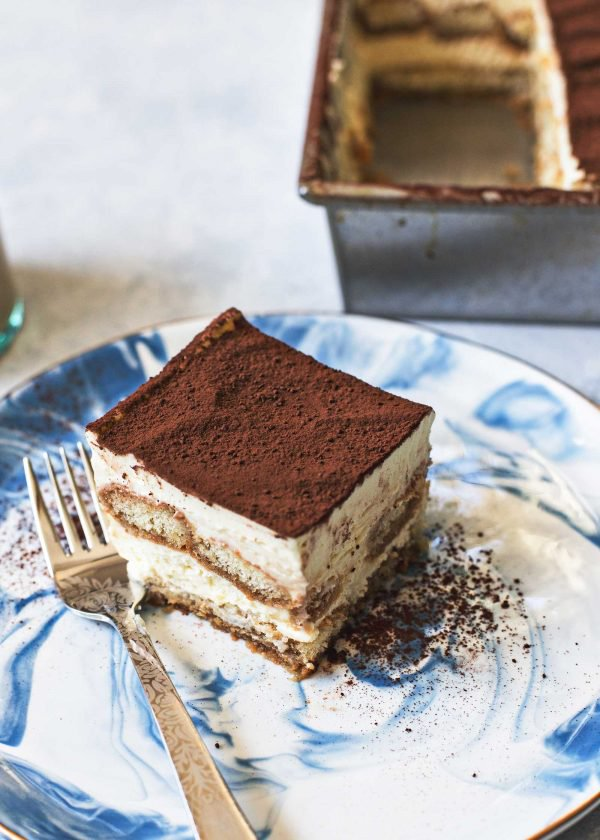
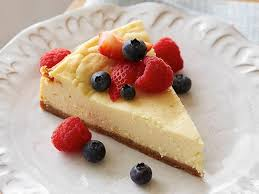

<b><h1>Sample-menu(2)
</h1></b>
 
<b>CAKES
</b>
 
Tiramisu
 

 
-Traditional tiramisu contains a short list of ingredients: finger biscuits,
egg yolks, sugar, coffee, mascarpone cheese, cocoa powder and eventually
liquor.

-The original shape of the cake is round, although the shape 
of the biscuits allows the use of a rectangular or square pan,
spreading the classic image "to tile". However, it is also often
assembled in round glasses, which show the various layers, or 
pyramid. Modern versions have as a rule the addition of whipped 
cream or whipped egg, or both, combined with mascarpone cream.
This makes the dish lighter, thick and foamy.
 Among the most common alcoholic changes includes the addition
 of Marsala. The cake is usually eaten cold.

 Cheesecake
  
 
  
-Cheesecake is a sweet dessert consisting of one or more layers. The main, and thickest layer, consists of a mixture of soft, fresh cheese (typically cream cheese or ricotta), eggs, and sugar. If there is a bottom layer, it often consists of a crust or base made from crushed cookies (or digestive biscuits), graham crackers, pastry, or sometimes sponge cake.s It may be baked or unbaked (usually refrigerated).