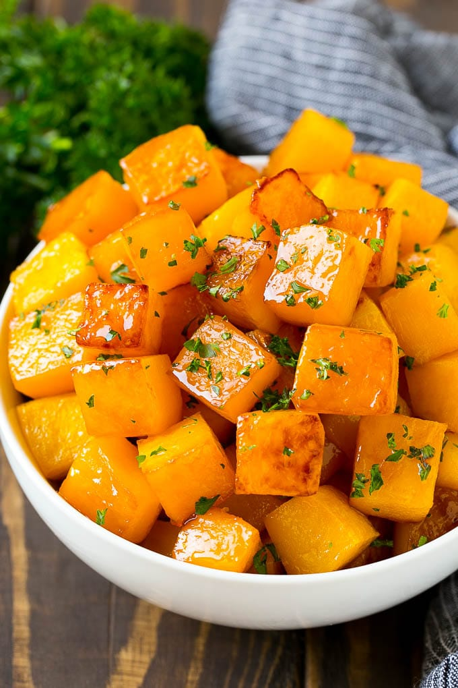

# Baked squash

## Ingredients
1 butternut squash , (1.2kg)
olive oil
1 red onion
1 clove of garlic
1 bunch of fresh sage , (30g)
10 sun-dried tomatoes
75 g vac-packed chestnuts
75 g basmati rice
75 g dried cranberries
1 pinch of ground allspice
red wine

## Method
Preheat the oven to 180°C/350°F/gas 4.
Wash the squash, carefully cut it in half lengthways, then remove and reserve the seeds. Use a spoon 
to score and scoop some flesh out, making a gully for the stuffing all along the length of the squash.
Finely chop the scooped-out flesh with the seeds and put into a frying pan on a medium heat with 2 
tablespoons of oil.
Peel, finely chop and add the onion and garlic, stirring regularly while you pick the sage leaves and 
finely chop them with the sun-dried tomatoes and chestnuts.
Stir into the pan with the rice, cranberries and allspice, add a good pinch of sea salt and black 
pepper and a swig of red wine, and mix well. Fry for 10 minutes, or until softened, stirring 
occasionally.
Pack the mixture tightly into the gully in the two squash halves, then press the halves firmly back 
together. Rub the skin of the squash with a little oil, salt and pepper, and if you’ve got them, pat 
on any extra herb leaves you have to hand.
Place the squash in the centre of a double layer of tin foil, then tightly wrap it up. Bake for around
 2 hours, or until soft and cooked through.
Once ready, take the squash to the table and open up the foil in front of everyone, then carve into 
nice thick slices and serve with all the usual trimmings.