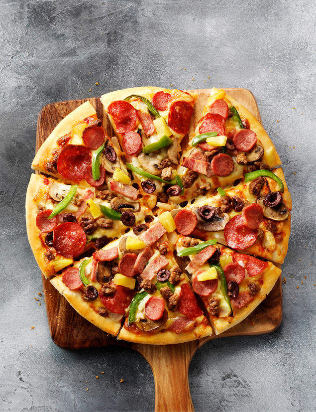

### Item name

<h1>
Pizza
 
</h1>

 
Pizza este un fel de mâncare cu originea în Napoli, Italia. Este o pâine plată, de obicei rotundă, acoperită cu sos de roșii și brânză, plus alte topping-uri opționale, preparată la cuptor.

Tipuri de pizza:
 
    1. Quatro Stagione 
    2. Capricciosa 
    3. Peperoni 
    4. Calzone 
    5. Mexicana 